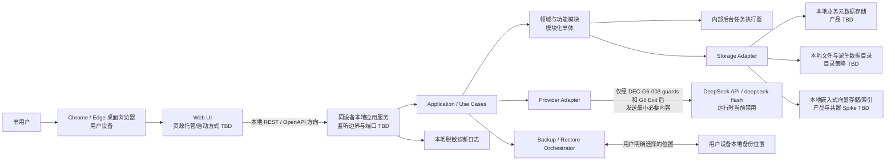
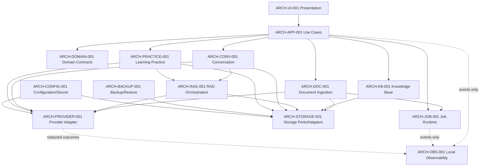
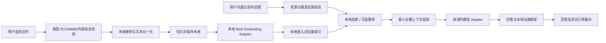

# Mindmate AI V1 总体技术架构
> 文档编号：SYSTEM-ARCH-MINDMATE-001
> 文档版本：v1.0-Draft.1
> 文档类型：architecture
> 关联对象：PROJECT mindmate-ai
> 文档状态：Draft
> ARCHITECTURE_STATUS：DRAFT
> 当前阶段：G6
> G6 状态：BLOCKED
> Workflow：WF-MINDMATE-001 v0.1
> 关联 PRD：PRD-MINDMATE-V1 v1.0-Draft.3 Approved
> 关联 UI 范围：UI-LOGIC-SCOPE-MINDMATE-001 v1.0-Draft.1
> 关联决策：DEC-BOOTSTRAP-001、DEC-G3-001、DEC-G5-001、DEC-G6-001、DEC-G6-002、DEC-G6-003、DEC-G6-004
> 创建日期：2026-09-21
> 更新时间：2026-09-21
> 生成上下文：G6 STAGE_DRAFT

## 1. 文档边界与结论

本文记录 V1 的供应商无关总体架构、逻辑模块、数据边界、RAG/异步处理、备份恢复、安全和非功能需求。本文不生成代码、脚手架、DDL、正式 OpenAPI、详细实现或依赖配置，也不进入 G7。

G6 入口已通过核验，架构 Draft 已生成。当前仍有一个 G6 正式出口阻断：DeepSeek Chat 的数据处理/保留/训练/删除/地域条款、账号资格和成本运行门禁尚未通过；本地 Embedding 与嵌入式向量存储方向虽已应用，但 Spike 和详细实现仍未完成。其结果会确定用户资料片段及会话上下文将发送给谁、在哪里处理、按何种条款保留，因此本文件将外部调用标为条件性边界，不视为用户已授权真实外发。其余供应商、数据库和协议选择保持 Proposed/TBD，不得从本 Draft 推断为已批准。

本文件的 ARCHITECTURE_STATUS 是 G6 出口状态，不等于每项技术选择已批准。文档仍为 Draft。

## 2. 输入成熟度与项目约束

输入成熟度：SUFFICIENT_FOR_CONTROLLED_DRAFT。产品目标、页面树、数据归属、部署大方向、外部 AI 模式和主要质量要求已有批准基线；供应商、实现技术和细节协议未确定。

| 约束 | 当前事实与状态 | 来源 |
|---|---|---|
| 用户与产品范围 | 本地单用户 V1；不实现真实登录、多用户、团队、管理后台或独立错题本 | Approved PRD；DEC-BOOTSTRAP-001；EVID-018 |
| UI 与交付 | 桌面优先 Web；Chrome/Edge 优先；本地运行服务；具体打包、启动器和操作系统支持仍 TBD | PROJECT_PROFILE；SRC-003；OPEN-04 |
| 部署 | 默认在用户设备运行；无远程业务服务器、云同步或远程备份 | DEC-BOOTSTRAP-001；DEC-G5-001 |
| 应用组织 | 模块化单体；V1 不采用微服务 | DEC-BOOTSTRAP-001/HIGH-03 |
| AI Provider | Chat 条件性基线为 DeepSeek API / `deepseek-flash`；Embedding 条件性采用本地 `BAAI/bge-small-zh-v1.5`；通过本地后端 Adapter，运行时因 guards 未完成而禁用 | DEC-BOOTSTRAP-001/HIGH-02；DEC-G6-003；DEC-G6-004；OPEN-01 |
| 本地数据 | 原始文件、业务数据、解析结果和向量数据默认保存在本地 | DEC-BOOTSTRAP-001/HIGH-02 |
| 外发边界 | 外部请求只可携带完成用户当前任务所必需的问题、文本片段和上下文；不把“本地使用”表述为完全离线 | Approved PRD；DEC-BOOTSTRAP-001 |
| 文件 | PDF、DOCX、Markdown、TXT；单文件 20MB、单次最多 5 个；V1 不做 OCR | Approved PRD；DEC-BOOTSTRAP-001 |
| API 与任务 | REST + OpenAPI 方向已确认；内部异步任务已确认；流式、上传、重试和任务存储协议仍 TBD | DEC-BOOTSTRAP-001/MEDIUM-04、HIGH-03 |
| 本地恢复 | V1 提供轻量本地备份/恢复；无云备份；内容、格式、加密、覆盖/合并和失败回滚未确认 | DEC-G5-001；TBD-PRD-006 |

### 2.1 架构目标与原则

- 本地优先、单用户最小复杂度；不引入微服务、消息队列集群、Kubernetes、远程业务服务器或企业多租户。
- 模块化单体优先；UI、用例、领域和基础设施保持边界，不以“单体”作为取消模块职责的理由。
- Provider 与 Storage Adapter 隔离；UI 和业务模块不直接依赖厂商 SDK 或数据库产品。
- 原始文件、业务元数据、派生文本、Embedding 与索引分层管理；具体物理格式及共置关系 TBD。
- 文件/RAG/备份长任务可观察、可安全重试、可恢复；不把不确定任务显示为成功。
- 删除、恢复、索引重建与版本迁移的语义可追踪；危险覆盖在具体方案批准前不得默认发生。
- 外部数据仅在完成 Provider 决策、配置及用户主动触发对应 AI 功能后，按最小必要范围发送。
- 本地日志不写 API Key、完整文件正文或完整敏感对话；默认不启用远程遥测。
- 未提供的性能、容量、成本、启动和可用性数值维持 NFR-TBD，不虚构 SLO。

## 3. TECH_DECISION 状态盘点

| ID | 决策领域 | 当前状态 | 当前结论 / 未决项 | 最晚确认 |
|---|---|---|---|---|
| TECH-DEC-001 | 应用交付形态 | CONFIRMED | 桌面优先 Web + 本地运行服务；具体安装包、启动方式及 OS 支持 TBD | G10 发布准备前 |
| TECH-DEC-002 | 本地进程与部署拓扑 | CONFIRMED | UI 在用户设备浏览器运行，调用同设备本地服务；UI 静态资源与 API 是否同进程、监听边界/端口 TBD | G8/G10 |
| TECH-DEC-003 | 前后端与模块边界 | CONFIRMED | 本地服务采用模块化单体、内部异步任务；REST/OpenAPI 为方向，不定义实现技术 | G7/G8 |
| TECH-DEC-004 | 外部 Provider、Embedding 和数据处理边界 | APPLIED_CONDITIONAL / BLOCKED | DEC-G6-003/004 已应用 DeepSeek Chat + 本地 BGE 条件性方向；API 数据条款、账号资格、地区、成本运行门禁和本地 Spike 未完成，运行时仍禁用 | G6 正式出口前 |
| TECH-DEC-005 | 本地业务数据、文件和向量存储 | APPLIED_DIRECTIONAL / TBD_PRODUCT | DEC-G6-004 已选择本地嵌入式向量存储 + Storage Adapter；具体产品/类别、物理共置、索引重建和失败恢复留 G8 Spike | G8，且早于 G9 数据设计 |
| TECH-DEC-006 | 文档入库与 RAG | CONFIRMED | 产品链路为校验→解析→切片→Embedding→本地索引→限定范围检索→生成与真实引用；解析器、切片、重排和阈值 TBD | G8 |
| TECH-DEC-007 | 长任务、重试、取消和重启恢复 | CONFIRMED | 采用内部异步任务方向；持久化、幂等键、重试次数和恢复算法 TBD | G8/G9 |
| TECH-DEC-008 | 用户问题及上下文外发 | CONFIRMED | 只限当前任务所需内容；不得将整份原始文件或全部历史默认上传；具体字段/窗口受 TECH-DEC-004 阻断 | 每个 Provider 集成前 |
| TECH-DEC-009 | 备份、恢复与索引重建 | CONFIRMED | 本地轻量导出/恢复方向已确认；清单、格式、加密、覆盖/合并、兼容与失败回滚 TBD | G8/G10 |
| TECH-DEC-010 | Secret、文件访问和本地安全 | CONFIRMED | Key 只在本地后端配置边界；不进入前端、仓库、业务日志；路径、权限和 OS Secret Store 细节 TBD | G8/G9 |
| TECH-DEC-011 | API、上传及流式协议 | CONFIRMED | REST + OpenAPI 方向已确认；正式契约、上传协议、流式协议和断线恢复 TBD | G9 |
| TECH-DEC-012 | 升级、数据迁移、诊断与 NFR | TBD_NONBLOCKING | 提议版本化迁移和本地诊断；迁移工具、启动/恢复指标、保留周期和更新回滚 TBD | G8/G10 |
| TECH-DEC-013 | 前后端语言、框架和工程工具 | TBD_NONBLOCKING | 前端 Web、后端本地服务和模块化边界已确认；语言、框架与工具仍 TBD | G8/G9 |

CONFIRMED 表示已有项目证据支持的方向，不表示实现细节已冻结。DEC-G6-003/004 已条件性应用 TECH-DEC-004 的 DeepSeek Chat、本地 BGE Embedding、成本政策和本地嵌入式向量存储方向，并承接 DEC-G6-001 no-call；DEC-G6-002 的 Alibaba Chat 路线保留为历史。OPEN-01 guards、成本实现和本地 Spike 仍是当前 G6 Exit BLOCKER。本轮不创建代表最终长期 Provider 约束的 ADR。

### 3.1 确定性与架构敏感项

| 确定性 | 内容 |
|---|---|
| CONFIRMED | 本地单用户、桌面优先 Web + 本地服务、模块化单体、内部异步任务、外部 Provider Adapter、本地数据/向量模式、REST/OpenAPI 方向、本地备份恢复方向和 V1 页面范围 |
| INFERRED | 浏览器 UI 经本机 API 使用同设备服务，是对已确认 Web + 本地服务形态的逻辑表达；静态资源如何托管、监听地址/端口和安装启动流程仍 TBD |
| PROPOSED | Storage/Provider ports、任务状态持久化、失败诊断与版本化的逻辑边界；只供 G7/G8 评审，不代表用户已批准具体实现 |
| ASSUMPTION | 不把未验证的性能、成本、操作系统、Provider 条款或可用性当作架构事实；本 Draft 没有依赖未标识的业务假设 |
| TBD | DeepSeek API 条款/账号/地域/成本运行门禁；本地 BGE/嵌入式向量 Spike；本地 DB/解析产品；框架/语言；流式/上传协议；备份格式/内容/加密/覆盖和失败回滚；运行打包和量化 NFR |

会导致整体边界变化的未知项：TECH-DEC-004 可能改变用户资料外发的接收方、处理地域和条款，因此阻断 G6 正式出口。改为远程业务服务器、改变 Provider 出站原则或扩大 V1 范围也必须触发 Workflow/需求复核。具体本地数据库、向量产品、UI 资源托管和启动打包仍可通过已定义的逻辑 Adapter/本地边界延后到责任阶段，而不改变本 Draft 的高层模块拓扑。

## 4. 部署拓扑

逻辑部署边界如下。图中产品/框架、端口、打包与具体存储均未锁定。



### 4.1 部署解释

- UI 由用户设备上的桌面浏览器展示；网页资源是否由本地 API 服务同进程提供，或采用独立本机静态资源进程，属于后续可逆实现细节。
- 应用服务、后台任务、配置和业务存储位于同一用户设备。不得将 Provider 当作业务服务器，也不得把文件库迁至云端。
- 本地 API 的绑定地址、端口、启动器、权限提示、系统托盘/后台常驻与退出行为 TBD；安全设计需限制非预期网络访问并防止任意路径读写。
- 外部模型和 Embedding 调用从本地 Provider Adapter 发起；当前未选定服务，架构图不是发起调用的授权。
- 备份目标必须是用户明确选择的本地位置；远程盘/云盘是否被用户选择不由系统自动上传，V1 不提供远程备份能力。

### 4.2 DeepSeek Chat Provider 条件性边界

- 当前 Chat Provider 条件性基线为 DeepSeek API / `deepseek-flash`；Embedding 条件性采用本地 `BAAI/bge-small-zh-v1.5`，不得把 DeepSeek API 推断为 Embedding 服务。
- 目标调用链为：浏览器 Web UI → 本机 REST/OpenAPI 方向 → 本地后端 Provider Adapter → `https://api.deepseek.com`。
- `DEEPSEEK_API_KEY` 只能由本地后端从本机环境变量或未提交 Secret 配置读取；前端、浏览器存储、备份正文、普通日志和测试夹具不得持有 Key。
- Base URL、模型 ID、thinking、输出上限、预算、重试和限流策略集中配置，不散落在业务模块。
- Key 缺失、认证失败、余额不足、HTTP 429、条款/账号/地区/成本 Guard 未通过时安全失败；不自动切换 Provider、不自动充值、不用重试绕过预算。
- 本轮只读取官方文档，不调用 API、不上传文件、不读取或验证 Key；Provider runtime 继续禁用。

## 5. 逻辑分层与模块职责

### 5.1 分层依赖



Domain/Application 声明内向接口；Provider 与 Storage 是这些接口的适配实现，依赖方向只能指向接口，领域逻辑不导入适配器。Job Runtime 调用已注册的任务处理器，不被任务处理器反向依赖；Observability 只接收脱敏事件。以上依赖方向不产生模块环。模块之间通过用例/端口通信，不共享厂商 SDK、持久化实体或 UI 状态模型。

### 5.2 模块清单

| 组件 ID | 职责、输入与输出 | 依赖方向 | 禁止承担 | REQ/Page；后续阶段 |
|---|---|---|---|---|
| ARCH-UI-001 | 展示五个一级页面、嵌套详情、三种对话模式、状态和用户反馈；输入用户操作/查询，输出展示状态 | 仅调用 Application 用例 | 不持有 Provider Key、不直接查存储、不决定资源归属 | REQ-PAGE-001~005；UI-*；G9.1/G10 |
| ARCH-APP-001 | 应用用例、事务边界、权限/资源归属检查和模块编排；输入命令/查询，输出业务结果 | Domain 与功能端口 | 不承载 UI 组件状态、供应商 SDK 或文件格式实现 | 全部 REQ；G7/G8/G9 |
| ARCH-DOMAIN-001 | 定义知识库、文件、会话、引用、陪练、任务、Provider/Storage 端口与核心规则 | 被 Application/模块依赖 | 不依赖 Web、数据库、文件系统或 Provider SDK | REQ-KB/FILE/CHAT/CITE/PRACTICE；G7/G8 |
| ARCH-DOC-001 | 文件安全校验、解析、文本归一化、切片和入库命令；输入本地文件/任务，输出解析结果与处理状态 | Domain Ports、Job、Provider/Storage Ports | 不直接暴露外部 Provider 给 UI；不把派生文本写回原文件 | REQ-FILE、REQ-TASK；UI-FILE-*；G8 |
| ARCH-KB-001 | 知识库 CRUD、资源归属、文件关联、删除协调和列表查询 | Domain、Storage Port、Document 用例 | 不执行 RAG 提示拼装或 UI 导航 | REQ-KB；UI-KB-*；G7/G8 |
| ARCH-CONV-001 | 会话、消息、模式与范围持久化；自由对话/资料问答用例；失败时保留用户输入 | Application、RAG、Provider/Storage Ports | 不从全库越权检索；不自行伪造引用 | REQ-CHAT/HISTORY/CITE；UI-CHAT-*；G8 |
| ARCH-PRACTICE-001 | 陪练配置、逐题状态、题目/作答/反馈/结束总结 | Application、RAG、Provider/Storage Ports | 不创建独立错题本或独立一级页面 | REQ-PRACTICE；UI-MODE-PRACTICE-001；G8 |
| ARCH-RAG-001 | 范围校验、检索、可选重排、上下文上限、证据绑定和不足拒答 | KB/Document Read Ports、Storage Vector Port、Provider Port | 不决定 Provider 品牌；不信任模型自报引用 | REQ-CHAT-008、REQ-CITE、REQ-PRACTICE；G8 |
| ARCH-PROVIDER-001 | 统一模型/Embedding 请求接口、认证、超时/限流分类和响应归一化 | 实现内向 Provider Port；读取本地 Secret | 不由 UI 直接调用；不记录 Key/完整文本；未过决策门禁前不接入真实服务 | REQ-CHAT/FILE/TASK/PRIVACY；TECH-DEC-004；G8/G9 |
| ARCH-STORAGE-001 | 本地元数据、原始/派生文件、会话和向量索引的逻辑仓储接口与本地适配 | 实现内向 Storage Ports | 不替业务模块决定删除/恢复语义；不锁定具体产品 | REQ-KB/FILE/HISTORY/PRIVACY；G8/G9 |
| ARCH-JOB-001 | 内部任务状态、进度、取消标记、重试边界和重启扫描 | 调用模块注册的 Task Handler；持久化经 Storage Port | 不形成独立消息服务/分布式队列；不静默将失败转成功 | REQ-TASK/FILE；G8/G9 |
| ARCH-BACKUP-001 | 编排导出、清单、完整性检查、恢复前检查、恢复计划与恢复后重建 | 通过 Storage Port 和内部 Job 处理 | 不上传云端；不默认覆盖；不假设索引一定可携带 | DEC-G5-001、TBD-PRD-006、UI-BACKUP-001；G8/G10 |
| ARCH-CONFIG-001 | 本地运行配置、Provider Key 注入和配置有效性检查 | 向 Provider/Storage Adapter 注入配置 | 不将 Secret 注入浏览器、本地备份明文或普通日志 | REQ-PRIVACY-004；G8/G9 |
| ARCH-OBS-001 | 本地任务结果、耗时、状态、错误分类、重试次数及索引/备份版本的脱敏诊断 | 接收各模块事件，不被业务模块反向依赖 | 不采集完整原文、完整对话、API Key；不默认远程遥测 | REQ-QUALITY、REQ-PRIVACY；G8/G11 |

## 6. 核心数据分类

以下“备份候选”不代表已确定备份内容。仅限用户主动发起的本地备份；敏感等级是数据处理要求，不是数据已被导出的事实。

| 数据 | 默认保存类别 | 可能外发 | 备份候选 | 可重建性 | 删除影响 | 敏感级别 |
|---|---|---|---|---|---|---|
| 原始文件 | 用户设备本地文件目录 | 不整份上传；处理所需文本可能按获准 Provider 方案外发 | TBD | 否，原件不可从索引可靠还原 | 删除文件并清理派生数据；历史引用失效 | 高 |
| 解析文本 | 本地派生文件/本地存储 | 被选中的必要文本片段可能外发 | TBD | 可从原始文件重新解析，质量/定位可能变化 | 清理关联切片和索引 | 高 |
| 文件/知识库元数据 | 本地业务存储 | 默认否 | TBD | 部分可从文件重建，用户编辑字段不可保证 | 删除资源并级联清理 | 中 |
| 文档切片 | 本地存储 | 当前本地 BGE 方向不要求外发；若未来改为外部 Embedding，须重新核验并走 Provider 门禁 | DEC-G6-004；Spike TBD | 可从解析文本重新切片 | 删除时清理关联 Embedding 和向量索引 | 高 |
| Embedding | 本地向量数据 | 当前采用本地 BGE 方向，默认不外发；如未来改为外部 Provider 需重新核验条款 | DEC-G6-004；Spike TBD | 可由切片重算，但需模型版本与质量/资源验证 | 删除对应向量并更新索引 | 中至高 |
| 向量索引 | 本地索引 | 默认否 | 是否携带 TBD；可重建路径必须保留 | 可由 Embedding 重建 | 删除索引记录和引用关联 | 中 |
| 会话/消息 | 本地业务存储 | 当前请求所需的有限对话上下文可能外发 | TBD | 否，模型回复不可保证重现 | 删除会话、消息、引用关联与陪练记录 | 高 |
| 引用 | 本地引用关系及必要片段 | 与回答相关的必要上下文可能外发 | TBD | 关系可部分重建，原文依赖原文件 | 文件删除后标记失效；不伪造恢复 | 高 |
| 陪练状态 | 本地业务存储 | 当前题目、用户回答及必要资料片段可能外发 | TBD | 否，生成内容不可保证一致 | 删除会话时清理题目、答案和点评 | 高 |
| 后台任务状态 | 本地任务存储 | 默认否；不得在任务描述里塞入正文 | TBD | 可扫描未完成任务并按安全规则恢复，细节 TBD | 删除关联资源时取消/清理任务 | 低至中 |
| Provider/应用配置 | 本地后端配置边界 | Key 仅作为获准 Provider 认证材料；不作为提示词/业务数据 | Secret 默认不得随备份，最终规则 TBD | 可重新配置，不可从日志恢复 | 移除配置后相关功能不可调用 | 极高 |
| 备份清单/版本 | 用户选定本地备份位置 | 默认否 | 备份本身 | 用于完整性/兼容检查 | 备份文件由用户管理；应用删除与否 TBD | 高 |
| 本地诊断日志 | 本地脱敏日志 | 默认不外发 | 默认不纳入备份，待确认 | 不能重建运行事实 | 按保留策略清理；周期 TBD | 中至高 |

## 7. RAG 端到端链路



完整主链：

```text
文件导入
→ 类型/大小/内容安全校验
→ 本地解析与归一化
→ 切片
→ 在 Provider 门禁满足后生成 Embedding
→ 本地向量索引
→ 用户提问并验证资源范围
→ 本地检索/可选重排
→ 最小必要上下文组装
→ 在 Provider 门禁满足后模型生成
→ 依据本地检索结果绑定真实引用
```

### 7.1 异常和恢复原则

- 重复文件：按 PRD 已确认的文件名+内容指纹检查并提示跳过；不覆盖已有文件。另存为新文件规则仍 TBD。
- 解析失败：保留本地原文件和失败状态；不生成可用索引；重试策略与可恢复步骤留 G8。
- Embedding 失败/超时/限流/Key 错误：记录任务阶段和可理解错误；不宣称可问答；在 Provider 决策前不得执行真实请求。
- 部分成功：原文件和已验证阶段结果保留；各阶段状态与当前可用能力分开表达，不以某个子任务成功推导整份文件可用。
- 索引失效：用文件、切片、Embedding 模型/版本和索引版本关系识别；具体版本键和迁移方式 TBD。
- 删除：先按 Approved PRD 的级联边界清理文件片段和本地索引；历史引用只标记失效，不伪造原文。
- 模型/Embedding 变更：若向量空间不兼容，保留从原始文件→解析→切片→Embedding→索引的重建路径；是否重建全库或分批 TBD。
- 用户取消：记录取消发生阶段；保留已生成内容仅遵照当前状态规则；资源清理与任务终止的精确原子性留 G8/G9。
- 应用重启：扫描持久化的非终态任务，校验资源和幂等条件后恢复或标记可重试；不能盲目重复外发。

## 8. AI 对话模式

| Mode/Page ID | 输入来源与知识库依赖 | 上下文/Provider | 引用与持久化 | 失败行为与用户状态 |
|---|---|---|---|---|
| UI-MODE-FREE-001 / UI-CHAT-001 | 用户消息；不自动读取知识库 | 仅构造必要的当前会话上下文；真实外部调用受 TECH-DEC-004 门禁 | 不要求资料引用；消息、模式与生成结果本地保存 | 保留输入，显示生成/停止/失败和重试；Provider 未批准时不得发送 |
| UI-MODE-RAG-001 / UI-CHAT-001 | 用户问题 + 明确选择的知识库/文件范围 | 先本地检索，再只向获准 Provider 发送问题、所需片段及最小必要会话上下文 | 引用必须映射真实本地文件/片段；会话和引用关系本地保存 | 无证据时拒答；超时/限流保留输入；失效引用显示来源已删除 |
| UI-MODE-PRACTICE-001 / UI-CHAT-001 | 陪练设置、当前回答和选定资料范围 | 先本地取证，按当前题生成/点评的必要范围调用获准 Provider | 每题、回答、点评和资料依据本地保存；每次只出一道题 | 资料不足不出无依据题；失败保留题目/回答状态和恢复入口 |

三种模式共用 ARCH-CONV-001 会话和消息边界，不在 V1 扩展为独立学习陪练页面。外部调用状态、供应商失败分类和流式传输实现由 TECH-DEC-004 与 G8/G9 进一步确认。

## 9. 后台任务模型

逻辑任务状态：

```text
PENDING → RUNNING → SUCCEEDED
                  ↘ FAILED
                  ↘ PARTIAL
                  ↘ CANCELLED
```

覆盖范围：文件解析、摘要/标签、Embedding、索引更新/重建、删除清理、备份、恢复及恢复后索引重建。

- 状态、阶段和面向用户的错误应本地持久化，刷新后可查询。
- 任务处理器须可重复调用；以资源 ID、内容指纹、流水线版本和任务种类作为幂等设计候选，正式键与事务边界 TBD。
- 重试应限于可恢复错误，次数、退避、用户手动重试与自动重试范围 TBD；不得无限重试。
- 取消是状态变更，不保证撤销已完成外部请求；已生成内容和已提交数据按明确阶段呈现。
- 应用重启时只恢复可安全幂等的任务；正在执行但结果未知的外部调用先核对持久状态，不可直接重放。
- 不选择线程库、队列产品或调度器；V1 的执行边界是同一台设备上的内部任务运行时。

## 10. 数据出站矩阵

“可能外发”描述候选架构边界，不代表当前已授权或已调用。Provider 决策前，系统不应发起真实外部模型/Embedding 请求。

| 数据 | 默认位置 | 可能外发与条件 | 用户提示 | 日志/脱敏 |
|---|---|---|---|---|
| 原始文件 | 本地 | 不上传完整原件；处理所需文本可能在对应 AI 任务中分段发给已批准 Provider | 上传/使用前提示外部处理边界；供应商条款确认前阻止真实调用 | 不记录正文；只记录文件 ID、阶段和脱敏错误 |
| 文本切片 | 本地 | Embedding 时所需切片可能逐批发送；是否覆盖全篇取决于解析/切片任务，不能宣称只发少数片段 | 在选择资料处理前说明文本可能离开设备 | 不记录切片正文 |
| 用户问题 | 本地会话 | 用户主动提交需要 AI 生成的请求时，发送到已批准模型 Provider | 说明模型供应商及处理边界后方可实际启用 | 只记录任务 ID、长度/分类等最小诊断，不记录全文 |
| 检索上下文 | 本地检索 | 资料问答/陪练仅发送当前答案所需证据与必要对话上下文 | 明示所选知识库范围及外部处理提示 | 不记录上下文全文或引用原文 |
| 会话历史 | 本地 | 不默认上传全会话；仅允许任务需要且经界定的有限上下文 | 说明当前请求会携带哪些类型的历史上下文 | 禁止完整对话日志 |
| API Key | 本地后端配置 | 仅作为调用已批准 Provider 的认证材料；不进入用户文本、浏览器、仓库或普通日志 | Key 配置与连接状态应可理解；不回显密钥 | 永不记录密钥；错误信息须移除认证头/凭据 |
| 备份文件 | 用户选择的本地位置 | 应用不远程上传；用户自行把文件移出设备属于用户行为，不由 V1 自动同步 | 导出前提示可能包含原始资料/会话等敏感内容 | 默认不记录文件内容或完整路径 |
| 本地诊断日志 | 用户设备 | 默认无远程遥测/云日志 | 如将来增加远程诊断需单独决策和明确授权 | 仅状态、错误类别、时间、版本；脱敏资源 ID |
| Provider/应用配置 | 本地 | Provider 必需的认证信息按选定服务协议发送；其它配置默认不外发 | 服务选择和数据条款必须先确认 | 脱敏配置摘要，不记录密钥或完整环境变量 |

## 11. 备份、恢复与重建

逻辑组件：

- Backup Orchestrator：冻结/读取一致性快照的时机、导出/恢复作业协调；具体事务策略 TBD。
- Backup Manifest：候选记录格式版本、创建版本、内容清单、资源关系和完整性摘要；字段/编码 TBD。
- Compatibility Check：校验来源版本与当前应用兼容性；兼容矩阵和升级路径 TBD。
- Integrity Check：在应用数据前检查文件/清单完整性；算法与签名/校验字段 TBD。
- Restore Preflight：展示目标位置、冲突、容量和潜在覆盖；未确认前不执行破坏性覆盖。
- Restore Plan：在确认后的恢复范围内恢复本地原始文件和业务元数据；是否包含会话/引用/Embedding/索引尚未确定。
- Rebuild Path：索引缺失或不兼容时，恢复后从原始文件重新解析、切片、本地 BGE Embedding 和本地索引；若未来改为外部 Embedding，需重新通过 TECH-DEC-004 guards。
- Failure Handling：失败清理、恢复前快照、回滚或保留部分结果未确认，恢复不得宣称原子成功。

必须保留从备份校验→恢复前检查→用户确认→本地恢复→索引可用性检查→必要时重建→结果报告的完整路径。备份内容、格式、加密、覆盖/合并、保留周期、失败回滚、卸载和目录迁移均保持 TBD，不在 G6 Draft 中拍板。

## 12. 安全、错误与本地可观测性

### 12.1 安全约束

- 单用户不等于免权限检查：保留 userId/等价归属和服务层资源归属校验。
- API Key 不进入前端代码、浏览器存储、仓库、提示文本或普通日志；密钥轮换和 OS Secret Store 支持 TBD。
- 上传校验扩展名、MIME、实际内容、大小、加密/损坏状态；限制解析器可访问范围，拒绝目录穿越和任意路径访问。
- 将文件名、元数据和文档内容视为不可信输入；文档内指令不得覆盖系统规则或越权调用工具。
- 外部请求不得发送整份原始文件、与当前任务无关的会话历史或其它知识库数据。
- 本地 API 监听边界、CSRF/Origin 等浏览器本机风险、进程间密钥传递和文件权限在 G8/G9 安全设计中细化。
- 默认无远程遥测、云日志、远程备份、云同步或未经用户动作的后台 Provider 调用。

### 12.2 错误处理

| 类别 | 需要可见/记录的结果 | 恢复原则 |
|---|---|---|
| Provider 不可用、Key 错误、限流、超时 | 对话/文件任务显示可理解错误和当前阶段；不泄露认证细节 | 仅在 Provider 门禁通过后按有限重试/用户重试；具体策略 TBD |
| 流中断 | 保留已接收内容和用户输入；状态不得伪装为完成 | 恢复/重新生成语义及协议在 G9 定义 |
| 文件解析/Embedding 失败 | 失败文件不进入可用状态，保留原件和阶段信息 | 用户可重试或删除；自动重试次数 TBD |
| 磁盘不足/路径不可用 | 暂停会扩大数据写入的任务，展示本地问题 | 不删除原件，不报告成功；恢复后检查部分文件 |
| 数据库/索引损坏 | 区分元数据与可重建索引状态 | 优先验证本地备份；索引可走重建路径，元数据恢复规则 TBD |
| 备份完整性/兼容检查失败 | 在执行恢复前报告并停止破坏性操作 | 保留源数据和备份文件；部分恢复与回滚规则 TBD |
| Secret/路径/注入风险 | 拒绝越界路径或不安全输入并记录脱敏事件 | 不输出敏感内容；文档提示视为不可信数据 |

### 12.3 本地诊断事件

建议记录：任务 ID/类型/阶段/逻辑状态、开始结束时间、脱敏错误类别、重试次数、解析器/索引版本、备份版本及恢复结果。具体保留期限、轮转、导出与字段白名单 TBD。不得记录 API Key、完整原始文件、完整消息、完整检索上下文或不必要的用户路径；默认不开启云端遥测。

## 13. 非功能需求与待确认指标

| 架构关注点 | 已有 PRD 映射 | 当前可用目标/边界 | 状态 |
|---|---|---|---|
| 启动与可用性 | REQ-QUALITY-001、REQ-QUALITY-004 | 正常操作可见反馈；本地服务启动耗时、可用性/崩溃恢复无数值 | NFR-TBD-ARCH-001 |
| 文件规模与容量 | REQ-QUALITY-003、REQ-QUALITY-005 | 单用户 10 个知识库、每库 50 个文件、单文件 20MB；非压测结论 | 已确认目标，资源用量 TBD |
| 任务恢复 | REQ-TASK-001~005、REQ-QUALITY-004 | 刷新后可查状态；进程重启后可恢复/安全重试要求存在，恢复时间无数值 | NFR-TBD-ARCH-002 |
| 流式体验 | REQ-CHAT-004、REQ-QUALITY-002 | 生成状态目标 3 秒内可见、首字目标不超过 8 秒；协议与真实环境待测 | 数值沿用 PRD，未验证 |
| 数据完整性 | REQ-KB-005、REQ-FILE-010、REQ-PRIVACY-002 | 删除级联、引用失效和本地备份恢复方向明确；故障注入/回滚阈值 TBD | NFR-TBD-ARCH-003 |
| 隐私与安全 | REQ-PRIVACY-001~006 | 归属校验、最小必要外发、Secret 不入前端/日志、文件安全检查 | 设计约束；测试 Evidence 未产生 |
| 可维护与可替换 | Provider/Storage Adapter、模块化单体 | 不锁定框架/产品；替换不应污染 UI/Domain | 需 G7/G8 验证 |
| 备份恢复 | DEC-G5-001、TBD-PRD-006 | 本地轻量备份/恢复；内容与 RTO/RPO 无数值 | NFR-TBD-ARCH-004 |
| 错误诊断 | REQ-CHAT-005、REQ-TASK-003 | 用户可理解失败状态并保留输入/原文件；日志保留周期 TBD | NFR-TBD-ARCH-005 |

不得将上述指标表述为测试通过、性能达标或产品已具备恢复能力。验证证据在后续开发/测试阶段产生。

## 14. 技术栈汇总与责任阶段

| 技术领域 | 当前逻辑方案 | 状态 | 责任阶段 |
|---|---|---|---|
| 客户端 | 桌面优先 Web，五个一级页面壳 | Confirmed（形态）；框架 TBD | G8/G9.1 |
| 本地后端 | 同设备服务、模块化单体、REST/OpenAPI 方向 | Confirmed（边界）；语言/框架 TBD | G8/G9 |
| 元数据存储 | 本地持久化存储 Adapter | TBD（类别/产品） | G8/G9 |
| 文件存储 | 本地原始文件与派生数据逻辑隔离 | Confirmed（本地）；目录/格式 TBD | G8 |
| 向量存储 | 本地嵌入式 Vector Adapter，支持重建 | Applied Directional；产品/共置关系与 Spike TBD | G8 |
| 模型与 Embedding | 条件性 DeepSeek Chat 基线 + 本地 BGE Embedding + 本地后端 Provider Adapter | Applied Conditional；runtime disabled，API 条款/账号/地区/成本 guards BLOCKED，Embedding Spike TBD | G6 Exit 前 |
| 异步任务 | 本地内部任务运行时 | Confirmed（方向）；队列/线程/重试 TBD | G8/G9 |
| API/流式 | REST + OpenAPI；流式、上传和断线恢复未选 | Direction Confirmed；协议 TBD | G9 |
| 备份 | 用户发起、用户选择位置、本地导出/恢复 | Confirmed（方向）；格式/内容/加密/回滚 TBD | G8/G10 |
| 日志/诊断 | 本地脱敏事件，无默认远程遥测 | Confirmed（边界）；实现/保留 TBD | G8/G11 |

技术栈汇总由 TECH-DECISION 与批准决策得出；不把任何 Proposed 候选写作已选框架、厂商或产品。

## 15. G6 出口及后续复核

- 当前文档：Draft；不构成 G6 Approved/Baselined 技术基线。
- G6_ENTRY_VERIFICATION：PASSED（依据 Approved PRD、G5.5 EVID-023、UI/REQ 追踪、YAML 解析及现有入口状态）。
- TECH-DEC-004 Chat：已由 DEC-G6-003 / EVID-032 条件性修订为 DeepSeek API / `deepseek-flash`；Embedding 已由 DEC-G6-004 / EVID-034 条件性采用本地 BGE；运行时 Provider 请求保持禁用，DEC-G6-001 no-call guards 继续有效。
- Alibaba 历史 Provider 候选和官方资料比较见 docs/project/baseline/10_G6_PROVIDER_DECISION_REVIEW.md / EVID-026；历史应用见 EVID-028/029；当前 DeepSeek 修订见 DEC-G6-003 / EVID-032。
- 当前 DeepSeek Provider Guard Matrix 与 G6 Exit Preflight 见 docs/project/baseline/12_G6_DEEPSEEK_PROVIDER_GUARD_VERIFICATION.md / EVID-033；批量应用见 DEC-G6-004 / EVID-034；Alibaba Guard 见 11_G6_PROVIDER_GUARD_VERIFICATION.md（历史）。
- G6_STATUS：BLOCKED，唯一出口阻断仍为 OPEN-01 的 DeepSeek API 数据条款、账号/模型/余额、地区和成本运行门禁；本地 Embedding/向量 Spike 仍未完成。
- ARCHITECTURE_STATUS：DRAFT。
- G7_ENTRY_GATE：NOT_READY；G7_EXECUTION：NOT_STARTED。
- 模型路由保持 RECOMMEND_ONLY；本轮未执行模型切换、未执行 Bootstrap；路由降级不阻断 G6 文档产出。
- 完成 DEC-G6-003/004 的 DeepSeek guards、成本实现、本地 Embedding/向量 Spike 后，重新执行 ARCHITECTURE_EXIT_PREFLIGHT；只更新受影响的 Provider、出站矩阵、风险和追踪内容。
- Provider 确认不得被解释为 PRD 范围扩展或全量文件上传授权；仍需满足最小必要、敏感资料提示及用户当前任务触发边界。
